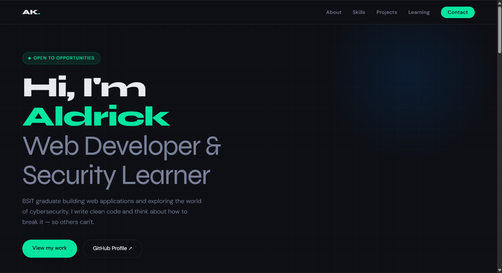

# 🌐 Aldrick's Developer Portfolio

> Personal portfolio website showcasing my web development projects and cybersecurity learning journey.

🔗 **Live site:** [shirakamikazuo.github.io/Portfolio](https://shirakamikazuo.github.io/Portfolio)

---

## 📸 Preview




---

## 🛠️ Built With

- HTML5
- CSS3
- JavaScript
- Google Fonts (Syne + DM Sans)
- GitHub Pages (hosting)

---

## ✨ Features

- Responsive design that works on desktop and mobile
- Hero section with animated badge and stats
- About section with personal background
- Skills section split into Web Development and Cybersecurity tracks
- Project cards linking directly to GitHub repos
- Certifications and learning roadmap
- Contact section with social links

---

## 🚀 Run Locally

```bash
git clone https://github.com/ShirakamiKazuo/Portfolio.git
cd Portfolio
```

Then open `index.html` in your browser — no build tools or dependencies needed.

---

## 📁 Project Structure

```
Portfolio/
├── index.html        # Main HTML file
├── style.css         # All styles
└── images/
    └── preview.png   # Screenshot for README
```

---

## 🗺️ Roadmap

- [ ] Add real project screenshots
- [ ] Add JavaScript animations
- [ ] Add TryHackMe profile badge
- [ ] Complete Google Cybersecurity Certificate
- [ ] Earn CompTIA Security+

---

## 👤 Author

**Aldrick**
- GitHub: [@ShirakamiKazuo](https://github.com/ShirakamiKazuo)
- LinkedIn: (https://www.linkedin.com/in/braganaza01/)
- Facebook: [facebook.com/profile](https://www.facebook.com/profile.php?id=100082291393545)

---

## 📄 License

This project is open source and available under the [MIT License](LICENSE).
